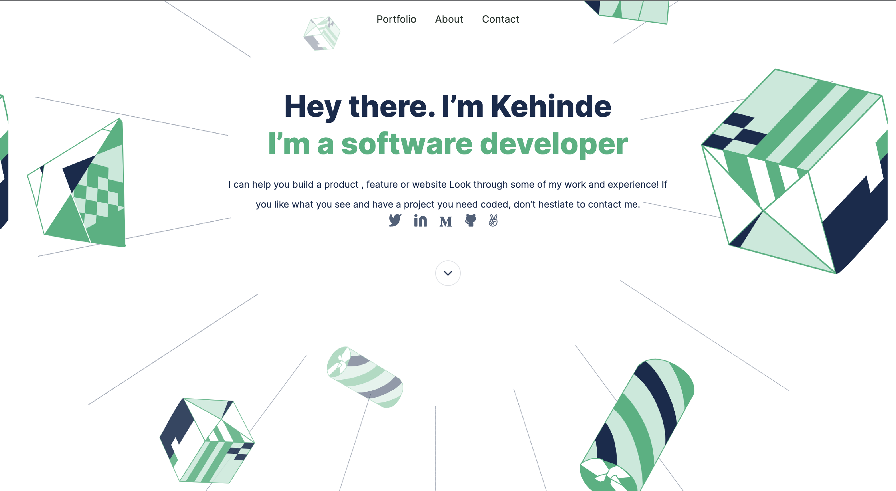

# portfolio-website

>This project is my personal portfolio website built at Microverse to showcase my projects and skills.

## Built With

- HTML
- CSS

## Live Demo

[Live Demo Link](https://kendoriddy.github.io/portfolio-website/)

## Getting Started

To get a local copy up and running:

1. Clone this repository or download the Zip folder:

**``git clone https://github.com/kendoriddy/portfolio-website.git``**

2. Navigate to the location of the folder in your machine:

**``you@your-Pc-name:~$ cd <folder>``**

## Author

👤 **Kehinde Ridwan Onifade**

- Github: [@kendoriddy](https://github.com/kendoriddy)
- Twitter: [@RideOnOne09](https://twitter.com/rideonone09)
- LinkedIn: [Kehinde Ridwan Onifade](https://www.linkedin.com/in/kehindeonifade/)

## Contributing

Contributions, issues, and feature requests are welcome!

Feel free to check the [issues page.](https://github.com/kendoriddy/portfolio-website/issues)

## Show your support

Give a ⭐️ if you like this project and how we manage to build it!

## Acknowledgments

Template from this [Figma](https://www.figma.com/file/l7SqJ3ZfkAKih9sFxvWSR4/Microverse-Student-Project-1) by [Microverse](https://bit.ly/MicroverseTN)

## 📝 License

This project is [MIT](./MIT.md) licensed